# Phase 1 Flow Diagram

This is the browser/editor-friendly Mermaid document for the Phase 1 pipeline.

## How to view

- In VS Code or Cursor: open this file and use Markdown preview if Mermaid is enabled
- In Obsidian: open the file directly
- In a browser: open `phase1_flow_preview.html`
- In Mermaid Live: paste the fenced diagram below into [https://mermaid.live](https://mermaid.live)

```mermaid
flowchart LR
  A["User uploads audio"] --> B["POST /api/analysis-runs"]
  B --> C["AnalysisRuntime.create_run()"]
  C --> D["measurement_outputs: queued"]

  D --> E["Measurement worker reserves run"]
  E --> F["server._execute_measurement_run()"]
  F --> G["analyze.py or analyze_fast.py"]

  G --> H["Raw analyzer payload"]
  H --> I["complete_measurement()"]
  I --> J["Authoritative measurement result"]

  I -. "strips" .-> X["transcriptionDetail removed from canonical measurement"]
  I --> K["_enqueue_requested_followups()"]

  K --> L["Queued symbolicExtraction attempt (optional)"]
  K --> M["Queued interpretation attempt (optional)"]

  L --> N["server._execute_symbolic_attempt()"]
  N --> O["Optional Demucs stem materialization"]
  O --> P["analyze_transcription() via TranscriptionBackend seam"]
  P --> Q["Best-effort symbolic result"]

  M --> R["server._execute_interpretation_attempt()"]
  J --> R
  Q --> R
  R --> S["Grounded interpretation result"]

  J --> T["GET /api/analysis-runs/{runId}"]
  Q --> T
  S --> T

  T --> U["parseCanonicalMeasurementResult()"]
  U --> V["projectPhase1FromRun()"]
  Q --> V
  V --> W["UI display Phase 1 projection"]
  W --> Y["App.tsx stores measurementResult + symbolicResult"]

  H --> Z["POST /api/analyze legacy path"]
  Z --> AA["_build_phase1(payload)"]
  AA --> AB["Legacy flat phase1 blob"]

  classDef auth fill:#d9f2d9,stroke:#2f6b2f,color:#111;
  classDef compat fill:#fde7c7,stroke:#8a5a00,color:#111;
  classDef risk fill:#f7d6d6,stroke:#8f2d2d,color:#111;
  classDef follow fill:#dbe9ff,stroke:#285ea8,color:#111;

  class J auth;
  class X risk;
  class L,M,N,O,P,Q,R,S follow;
  class Z,AA,AB,V,W compat;
```

